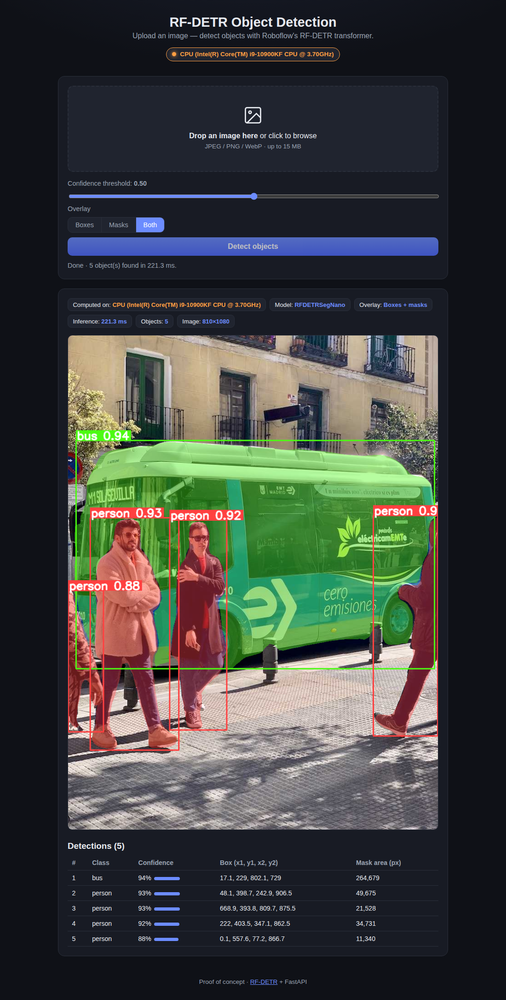
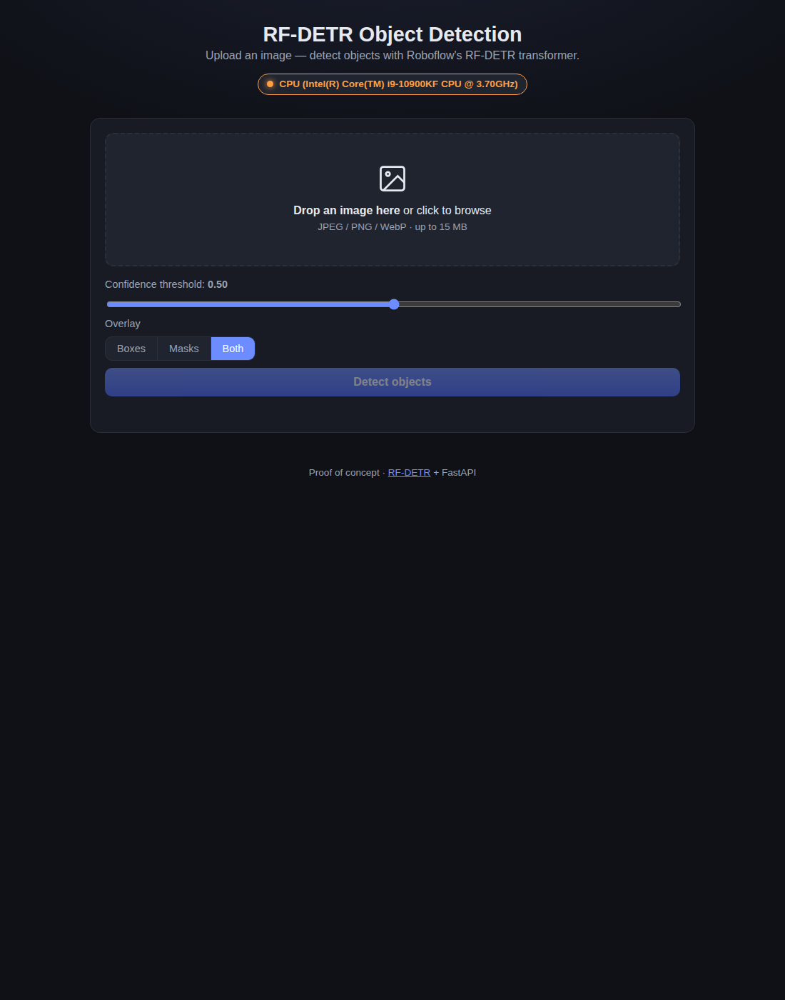
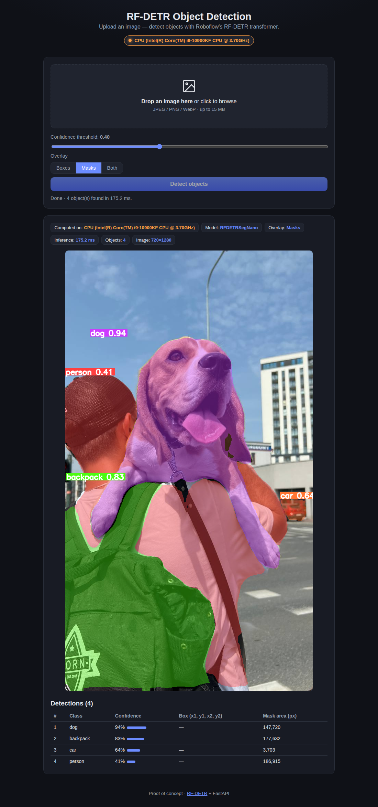

# RF-DETR Object Detection — FastAPI + Web UI

A small **proof of concept** that wraps [Roboflow's **RF-DETR**](https://github.com/roboflow/rf-detr)
real-time object detection **and instance segmentation** transformer in a
[FastAPI](https://fastapi.tiangolo.com/) backend with a lightweight web frontend
for uploading images and viewing results.

It detects objects, draws bounding boxes and a light segmentation overlay (you
choose boxes, masks, or both), **auto-detects a GPU and falls back to CPU**, and
always shows **which hardware performed the inference** — both in the API
responses and in the UI.



---

## Features

- **FastAPI backend** exposing a clean JSON API (`/api/health`, `/api/detect`,
  plus a queued job API — see below).
- **Detection + instance segmentation** with RF-DETR (defaults to the `nano`
  segmentation model for fast CPU performance; `small`/`medium`/`large`
  selectable via env var). Choose the overlay per request: **boxes, masks, or
  both**.
- **GPU when available, CPU otherwise** — detection is automatic and safe even
  when a GPU is present but unusable (e.g. driver/library mismatch).
- **Hardware transparency** — every response and the UI report the exact device
  (e.g. `GPU (NVIDIA RTX 4090)` or `CPU (Intel Core i9-10900KF)`), model, and
  inference time in milliseconds.
- **Bounded job queue** — an async `/api/jobs` endpoint queues uploads and
  drains them with a background worker, so a burst of requests can't overwhelm
  the single model.
- **Web UI** — drag-and-drop upload, confidence-threshold slider, box/mask/both
  overlay selector, annotated result image, and a detections table.
- **End-to-end tests** with `pytest` + FastAPI's `TestClient`, plus a headless
  **Playwright** browser test.

## Architecture

```
┌──────────────┐   multipart upload    ┌───────────────────────────┐
│   Browser    │ ───────────────────▶  │   FastAPI  (backend/)     │
│ (frontend/)  │                       │  ┌─────────────────────┐  │
│  index.html  │ ◀───────────────────  │  │ inference.py        │  │
│  app.js      │   JSON: detections,   │  │  RF-DETR (singleton)│  │
│  style.css   │   annotated image,    │  │  hardware.py        │  │
└──────────────┘   hardware, timing    │  └─────────────────────┘  │
                                       └───────────────────────────┘
```

- `backend/hardware.py` — detects whether torch can actually use a CUDA GPU and
  produces a human-readable device label.
- `backend/inference.py` — loads RF-DETR once, runs detection/segmentation,
  annotates the image (boxes + light mask overlay via
  [`supervision`](https://github.com/roboflow/supervision)), and returns
  structured results plus timing and hardware info.
- `backend/jobs.py` — bounded in-memory queue + background worker for the async
  job API.
- `backend/main.py` — FastAPI app; serves the API and the static frontend.
- `frontend/` — single-page UI (no build step, vanilla JS).

## Quick start

Requires [`uv`](https://github.com/astral-sh/uv) (Python 3.12+).

```bash
# 1. Install dependencies (creates a .venv)
uv sync

# 2. Run the app  (downloads the RF-DETR weights, ~128 MB, on first launch)
./run.sh
# or:  uv run uvicorn backend.main:app --host 127.0.0.1 --port 8011
```

Then open **http://127.0.0.1:8011** and upload an image.

### Configuration

| Env var            | Default | Description                                           |
| ------------------ | ------- | ----------------------------------------------------- |
| `RFDETR_TASK`      | `segment` | `segment` (masks + boxes) or `detect` (boxes only). |
| `RFDETR_MODEL`     | `nano`  | Model size: `nano`, `small`, `medium`, `large`.       |
| `RFDETR_OPTIMIZE`  | `1`     | Fuse/optimize the model for inference (best-effort).  |
| `RFDETR_WORKERS`   | `1`     | Background queue workers (concurrent jobs).           |
| `RFDETR_QUEUE_MAX` | `32`    | Max queued jobs before `/api/jobs` returns 503.       |
| `HOST` / `PORT`    | `127.0.0.1` / `8011` | Bind address for `run.sh`.               |

## API

### `GET /api/health`

```json
{
  "status": "ok",
  "hardware": {
    "device": "cpu",
    "device_type": "CPU",
    "name": "Intel(R) Core(TM) i9-10900KF CPU @ 3.70GHz",
    "cuda_available": false,
    "details": { "torch_version": "2.12.0+cu130" }
  },
  "hardware_label": "CPU (Intel(R) Core(TM) i9-10900KF CPU @ 3.70GHz)",
  "model": "RFDETRSegNano",
  "model_size": "nano",
  "task": "segment",
  "loaded": true
}
```

### `POST /api/detect` (synchronous)

Multipart form fields: `file` (image), `threshold` (float, default `0.5`),
`mode` (`box` | `mask` | `both`, default `both`).

`mode` controls both what is drawn and what each detection returns:
`box` returns boxes only, `mask` returns segmentation `polygon` + `mask_area`
only, `both` returns both (with a light mask overlay on the image).

```bash
curl -s -X POST http://127.0.0.1:8011/api/detect \
  -F "file=@tests/images/people.jpg;type=image/jpeg" \
  -F "threshold=0.5" -F "mode=both" | jq '{count, mode, inference_ms, detections}'
```

```json
{
  "mode": "both",
  "task": "segment",
  "count": 5,
  "inference_ms": 226.3,
  "hardware_label": "CPU (Intel(R) Core(TM) i9-10900KF CPU @ 3.70GHz)",
  "detections": [
    { "class_id": 6, "class_name": "bus", "confidence": 0.95,
      "box": { "x1": 9.0, "y1": 229.5, "x2": 806.8, "y2": 734.5 },
      "mask_area": 184678, "polygon": [[12, 235], [40, 232], "..."] }
  ]
}
```

The response also includes `annotated_image` — a base64 PNG data URL with the
overlay drawn on — `image_size`, `model`, and the full `hardware` object.

### Queued job API (async)

For unattended/bursty use, submit to a bounded queue instead of running inline.
A background worker drains the queue one job at a time (per worker), so a flood
of uploads queues up rather than overwhelming the model.

- `POST /api/jobs` — same form fields as `/api/detect`. Returns **202** with a
  `job_id` and `status: "queued"` (or **503** if the queue is full).
- `GET /api/jobs/{job_id}` — poll a job; returns `status`
  (`queued` → `processing` → `done`/`error`) and, when done, the full `result`
  (identical shape to `/api/detect`).
- `GET /api/queue` — queue stats (`queued`, `workers`, `jobs_by_status`, …).

```bash
# Submit, capture the id, then poll until done
JOB=$(curl -s -X POST http://127.0.0.1:8011/api/jobs \
  -F "file=@tests/images/people.jpg;type=image/jpeg" -F "mode=both")
JID=$(echo "$JOB" | jq -r .job_id)
curl -s http://127.0.0.1:8011/api/jobs/$JID | jq '{status, result: (.result | {count, mode})}'
```

## Tests

```bash
uv run pytest -q
```

Two layers of tests:

- **API end-to-end** (`tests/test_api.py`) — loads the real model and exercises
  the HTTP API via FastAPI's `TestClient`: health, detection on a sample image,
  and rejection of non-image / empty uploads.
- **Browser end-to-end with Playwright** (`tests/test_e2e_playwright.py`) —
  spawns the real uvicorn server in a subprocess, drives a headless Chromium
  browser through the actual UI (upload -> detect -> read results), and asserts on
  what the user sees (hardware badge, detection count vs. table rows, annotated
  image, "Computed on" device). It also **regenerates the screenshots** below.

```bash
# One-time browser download, then run the browser E2E test:
uv run playwright install chromium
uv run pytest tests/test_e2e_playwright.py -q
```

## Docker (RHEL 9)

A [`Dockerfile`](Dockerfile) based on Red Hat's **UBI 9** Python 3.12 image is
included.

```bash
# Build (pre-downloads model weights by default; pass --build-arg PREFETCH_WEIGHTS=0 to skip)
docker build -t rf-detr-example .          # or: podman build -t rf-detr-example .

# Run (CPU)
docker run --rm -p 8011:8011 rf-detr-example

# Run with a GPU (requires the NVIDIA Container Toolkit)
docker run --rm --gpus all -p 8011:8011 rf-detr-example
# podman:  podman run --rm --device nvidia.com/gpu=all -p 8011:8011 rf-detr-example
```

Then open <http://localhost:8011>. The container reports the active device on
`/api/health` and in the UI just like the local app. The image bundles CUDA
torch (~7 GB); the same image runs on CPU or GPU.

> **podman note:** the `HEALTHCHECK` is honored only with the Docker image
> format — build with `podman build --format docker -t rf-detr-example .` if you
> want it. It is ignored (with a harmless warning) under the default OCI format.

This image has been built and validated end-to-end on RHEL 9 / UBI 9 (health +
detection inside the container, with automatic CPU fallback).

## Screenshots

| Upload screen | Boxes + masks (bus) | Masks only (dog) |
| --- | --- | --- |
|  |  |  |

> The "Boxes / Masks / Both" control selects the overlay; the bus result shows
> boxes plus a light segmentation overlay, the dog result shows masks only. The
> badge at the top and the "Computed on" chip make the active hardware explicit.
> In this environment the host GPU has a driver/library version mismatch, so
> inference correctly falls back to **CPU** — on a machine with a working CUDA
> GPU the same code reports and uses the **GPU** automatically.

## Notes & limitations

- This is a proof of concept: single-process, in-memory model and job queue, no
  auth, no persistence. The queue is in-memory, so jobs are lost on restart.
- RF-DETR is COCO-pretrained (80 classes). For custom classes, fine-tune RF-DETR
  and point the loader at your weights.
- First launch downloads model weights to `~/.roboflow/models/`.

## License

Proof-of-concept code in this repo: MIT. RF-DETR and its Apache-licensed weights
are © Roboflow under their respective licenses.
